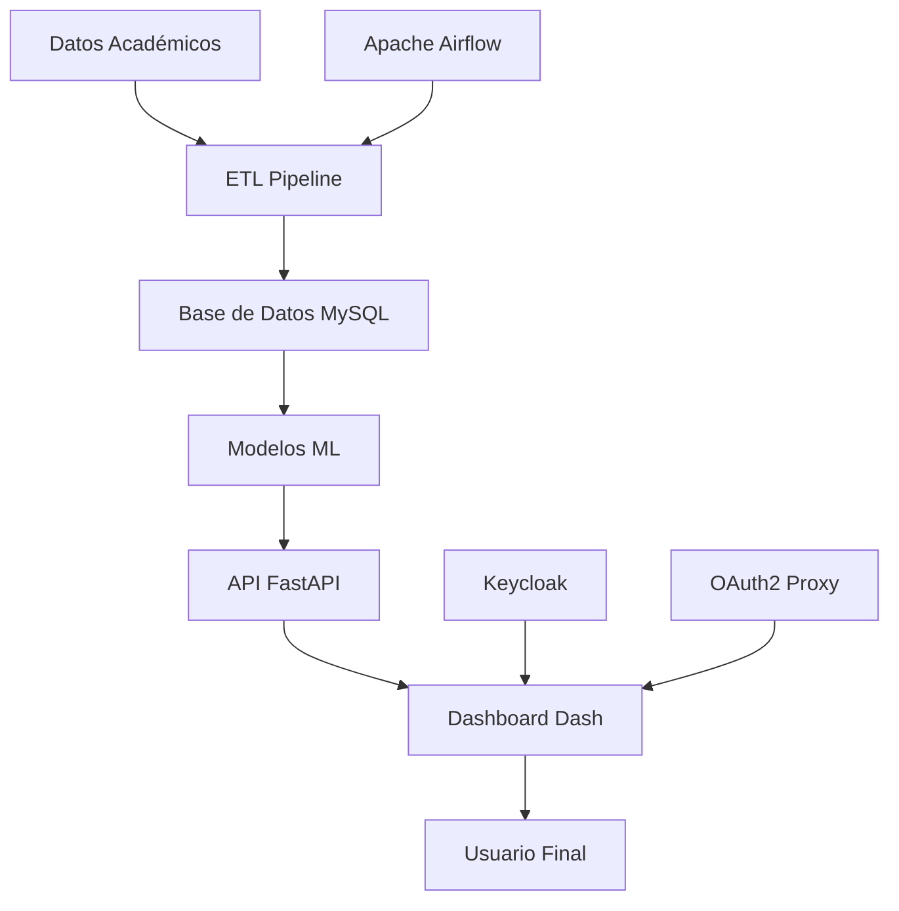

# EGI-ML Control 🎓📊

[](https://docs.docker.com/compose/)
[](https://www.python.org/downloads/)

## 📋 Descripción

Sistema automatizado que procesa datos académicos, identifica grupos de riesgo de deserción mediante algoritmos de Machine Learning y facilita la asignación de becas. El proyecto combina herramientas de código abierto para garantizar accesibilidad y escalabilidad en el análisis predictivo educativo.

## 🎯 Objetivos

- **Predicción de Deserción**: Identificar estudiantes en riesgo de abandonar sus estudios
- **Asignación de Becas**: Automatizar el proceso de selección de beneficiarios
- **Análisis Académico**: Proporcionar insights sobre el rendimiento estudiantil
- **Dashboards Interactivos**: Visualización en tiempo real para la toma de decisiones

## 🏗️ Arquitectura del Sistema



### Componentes Principales

- **🔄 Apache Airflow**: Orquestación de pipelines ETL y ML
- **🎨 Dash**: Dashboards interactivos para visualización
- **⚡ FastAPI**: API REST para servicios backend
- **🗄️ MySQL**: Base de datos para almacenamiento

## 🚀 Inicio Rápido

### Prerrequisitos

- [Docker](https://docs.docker.com/get-docker/) >= 20.10
- [Docker Compose](https://docs.docker.com/compose/install/) >= 2.0
- Git

### Instalación

1. **Clonar el repositorio**
   ```bash
   git clone https://github.com/tu-usuario/egi-ml-control.git
   cd egi-ml-control
   ```

2. **Configurar variables de entorno**
   ```bash
   cp .env.example .env
   # Editar .env con tus configuraciones
   ```

3. **Construir y ejecutar con Docker Compose**
   ```bash
   # Primera ejecución (construir imágenes)
   docker compose up --build
   
   # Ejecuciones posteriores
   docker compose up
   ```

### 🔧 Comandos Útiles

```bash
# Detener contenedores (mantener datos)
docker compose stop

# Limpiar entorno completamente
docker compose down

# Ver logs de un servicio específico
docker compose logs -f airflow

# Reconstruir solo un servicio
docker compose up --build mysql-server
```

## 📊 Servicios y Puertos

| Servicio | Puerto | Descripción |
|----------|--------|-------------|
| **Apache Airflow** | [8080](http://localhost:8080) | Orquestación de workflows |
| **Panel Dashboard** | [5000](http://localhost:5000) | Visualización interactiva |
| **Frontend** | [3000](http://localhost:3000) | Interfaz principal |
| **MySQL** | 3306 | Base de datos |

## 🗂️ Estructura del Proyecto

```
egi-ml-control/
├── 📁 diagrams/                    # Diagramas de arquitectura
│   ├── funcionales.md
│   ├── Infraestructura_ambientes.md
│   └── repositorios_pipeline.md
├── 📁 data/                        # Datos de entrada y modelos
├── 📁 volumes/                     # Volúmenes persistentes
├── 📄 docker-compose.yml          # Definición de servicios
├── 📄 Dockerfile                  # Imagen personalizada
├── 📄 requirements.txt            # Dependencias Python
├── 📄 .dockerignore               # Archivos excluidos de Docker
├── 📄 .gitignore                  # Archivos excluidos de Git
└── 📄 README.md                   # Esta documentación
```

## 📈 Flujo de Datos

### Pipeline ETL

1. **Extracción**: Lectura de datos académicos desde CSV
2. **Transformación**: Limpieza y normalización de datos
3. **Carga**: Almacenamiento en base de datos MySQL
4. **Validación**: Verificación de integridad

### Pipeline de Machine Learning

1. **Preparación**: Ingeniería de características
2. **Entrenamiento**: Modelos de predicción (XGBoost, LightGBM)
3. **Validación**: Evaluación de performance
4. **Despliegue**: Modelo listo para predicciones

## 🐛 Solución de Problemas

### Problemas Comunes

**Error de autenticación en Airflow**
```bash
# Acceder al contenedor y verificar configuración
docker exec -it airflow bash
cat /opt/airflow/airflow.cfg | grep password
```

**Base de datos no conecta**
```sql
-- Configuración MySQL requerida
CREATE USER 'user'@'localhost' IDENTIFIED BY '1234';
CREATE DATABASE IF NOT EXISTS students;
GRANT ALL PRIVILEGES ON students.* TO 'user'@'localhost';
FLUSH PRIVILEGES;
```

**Volúmenes de datos**
```bash
# Verificar volúmenes montados
docker volume ls
docker compose down -v  # CUIDADO: Elimina datos
```

### Logs y Debugging

```bash
# Ver logs de todos los servicios
docker compose logs

# Logs específicos con seguimiento
docker compose logs -f mysql-server

# Inspeccionar red de contenedores
docker network ls
docker network inspect egi-ml-control_internal_network
```

## 🚀 Despliegue en Producción

### Consideraciones

- **HTTPS**: Configurar certificados SSL/TLS
- **Backup**: Implementar estrategia de respaldos automáticos
- **Monitoreo**: Agregar Prometheus + Grafana
- **Escalabilidad**: Considerar Kubernetes para alta disponibilidad

### Variables de Entorno Críticas

```env
# Seguridad
MYSQL_ROOT_PASSWORD=tu_password_mysql
```
