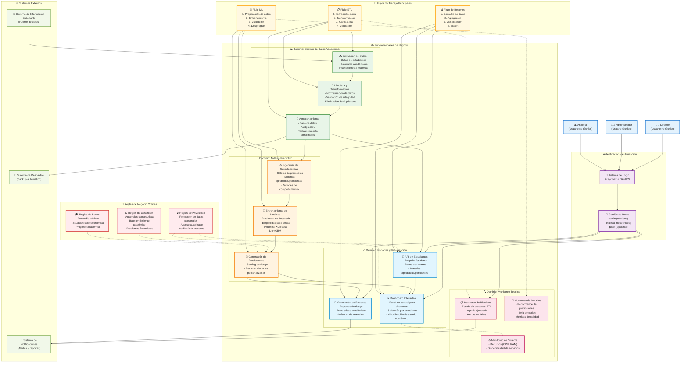

```mermaid
graph TB
    %% External Actors
    DIRECTOR["👨‍💼 Director<br/>(Usuario no técnico)"]
    ADMIN["👨‍💻 Administrador<br/>(Usuario técnico)"]
    ANALYST["📊 Analista<br/>(Usuario no técnico)"]
    
    %% Authentication & Authorization Layer
    subgraph "🔐 Autenticación y Autorización"
        LOGIN["🔑 Sistema de Login<br/>(Keycloak + OAuth2)"]
        ROLES["👥 Gestión de Roles<br/>- admin (técnicos)<br/>- analista (no técnicos)<br/>- guest (opcional)"]
    end
    
    %% Core Business Functions
    subgraph "📚 Funcionalidades de Negocio"
        
        %% Data Management Domain
        subgraph "📊 Dominio: Gestión de Datos Académicos"
            EXTRACT["📥 Extracción de Datos<br/>- Datos de estudiantes<br/>- Historiales académicos<br/>- Inscripciones a materias"]
            CLEAN["🧹 Limpieza y Transformación<br/>- Normalización de datos<br/>- Validación de integridad<br/>- Eliminación de duplicados"]
            STORE["💾 Almacenamiento<br/>- Base de datos PostgreSQL<br/>- Tablas: students, enrollments"]
        end
        
        %% ML/Analytics Domain  
        subgraph "🤖 Dominio: Análisis Predictivo"
            FEATURE_ENG["⚙️ Ingeniería de Características<br/>- Cálculo de promedios<br/>- Materias aprobadas/pendientes<br/>- Patrones de comportamiento"]
            ML_TRAINING["🎯 Entrenamiento de Modelos<br/>- Predicción de deserción<br/>- Elegibilidad para becas<br/>- Modelos: XGBoost, LightGBM"]
            PREDICTION["🔮 Generación de Predicciones<br/>- Scoring de riesgo<br/>- Recomendaciones personalizadas"]
        end
        
        %% Reporting Domain
        subgraph "📈 Dominio: Reportes y Visualización"
            DASHBOARD["📊 Dashboard Interactivo<br/>- Panel de control para directores<br/>- Selección por estudiante<br/>- Visualización de estado académico"]
            REPORTS["📄 Generación de Reportes<br/>- Reportes de riesgo<br/>- Estadísticas académicas<br/>- Métricas de retención"]
            API_STUDENTS["🔗 API de Estudiantes<br/>- Endpoint /students<br/>- Datos por alumno<br/>- Materias aprobadas/pendientes"]
        end
        
        %% Monitoring Domain
        subgraph "🔍 Dominio: Monitoreo Técnico"
            PIPELINE_MONITOR["📋 Monitoreo de Pipelines<br/>- Estado de procesos ETL<br/>- Logs de ejecución<br/>- Alertas de fallos"]
            MODEL_MONITOR["🎯 Monitoreo de Modelos<br/>- Performance de predicciones<br/>- Drift detection<br/>- Métricas de calidad"]
            SYSTEM_MONITOR["⚙️ Monitoreo de Sistema<br/>- Recursos (CPU, RAM)<br/>- Disponibilidad de servicios"]
        end
    end
    
    %% External Systems
    subgraph "🌐 Sistemas Externos"
        SIS["🏫 Sistema de Información Estudiantil<br/>(Fuente de datos)"]
        EMAIL["📧 Sistema de Notificaciones<br/>(Alertas y reportes)"]
        BACKUP["💾 Sistema de Respaldos<br/>(Backup automático)"]
    end
    
    %% Core Data Flows
    subgraph "🔄 Flujos de Trabajo Principales"
        ETL_FLOW["📋 Flujo ETL<br/>1. Extracción diaria<br/>2. Transformación<br/>3. Carga a BD<br/>4. Validación"]
        ML_FLOW["🤖 Flujo ML<br/>1. Preparación de datos<br/>2. Entrenamiento<br/>3. Validación<br/>4. Despliegue"]
        REPORTING_FLOW["📊 Flujo de Reportes<br/>1. Consulta de datos<br/>2. Agregación<br/>3. Visualización<br/>4. Export"]
    end
    
    %% Business Rules
    subgraph "📏 Reglas de Negocio Críticas"
        DESERTION_RULES["⚠️ Reglas de Deserción<br/>- Ausencias consecutivas<br/>- Bajo rendimiento académico<br/>- Problemas financieros"]
        SCHOLARSHIP_RULES["🎓 Reglas de Becas<br/>- Promedio mínimo<br/>- Situación socioeconómica<br/>- Progreso académico"]
        PRIVACY_RULES["🔒 Reglas de Privacidad<br/>- Protección de datos personales<br/>- Acceso autorizado<br/>- Auditoría de accesos"]
    end
    
    %% User Interactions
    DIRECTOR --> LOGIN
    ADMIN --> LOGIN  
    ANALYST --> LOGIN
    
    LOGIN --> ROLES
    
    %% Role-based access
    ROLES --> DASHBOARD
    ROLES --> REPORTS
    ROLES --> PIPELINE_MONITOR
    ROLES --> API_STUDENTS
    
    %% Data flow connections
    SIS --> EXTRACT
    EXTRACT --> CLEAN
    CLEAN --> STORE
    STORE --> FEATURE_ENG
    FEATURE_ENG --> ML_TRAINING
    ML_TRAINING --> PREDICTION
    
    %% API and Dashboard connections
    STORE --> API_STUDENTS
    API_STUDENTS --> DASHBOARD
    PREDICTION --> DASHBOARD
    PREDICTION --> REPORTS
    
    %% Monitoring connections
    ETL_FLOW -.-> PIPELINE_MONITOR
    ML_FLOW -.-> MODEL_MONITOR
    DASHBOARD -.-> SYSTEM_MONITOR
    
    %% Business rules enforcement
    DESERTION_RULES -.-> PREDICTION
    SCHOLARSHIP_RULES -.-> PREDICTION
    PRIVACY_RULES -.-> API_STUDENTS
    PRIVACY_RULES -.-> DASHBOARD
    
    %% External notifications
    REPORTS --> EMAIL
    PIPELINE_MONITOR --> EMAIL
    STORE --> BACKUP
    
    %% Workflow orchestration
    ETL_FLOW --> EXTRACT
    ETL_FLOW --> CLEAN
    ETL_FLOW --> STORE
    ML_FLOW --> FEATURE_ENG
    ML_FLOW --> ML_TRAINING
    ML_FLOW --> PREDICTION
    REPORTING_FLOW --> API_STUDENTS
    REPORTING_FLOW --> DASHBOARD
    REPORTING_FLOW --> REPORTS
    
    %% Styling
    classDef userStyle fill:#e3f2fd,stroke:#1976d2,stroke-width:2px
    classDef authStyle fill:#f3e5f5,stroke:#7b1fa2,stroke-width:2px
    classDef dataStyle fill:#e8f5e8,stroke:#388e3c,stroke-width:2px
    classDef mlStyle fill:#fff3e0,stroke:#f57c00,stroke-width:2px
    classDef reportStyle fill:#e1f5fe,stroke:#0288d1,stroke-width:2px
    classDef monitorStyle fill:#fce4ec,stroke:#c2185b,stroke-width:2px
    classDef externalStyle fill:#f1f8e9,stroke:#689f38,stroke-width:2px
    classDef workflowStyle fill:#fff8e1,stroke:#ffa000,stroke-width:2px
    classDef rulesStyle fill:#ffebee,stroke:#d32f2f,stroke-width:2px
    
    class DIRECTOR,ADMIN,ANALYST userStyle
    class LOGIN,ROLES authStyle
    class EXTRACT,CLEAN,STORE dataStyle
    class FEATURE_ENG,ML_TRAINING,PREDICTION mlStyle
    class DASHBOARD,REPORTS,API_STUDENTS reportStyle
    class PIPELINE_MONITOR,MODEL_MONITOR,SYSTEM_MONITOR monitorStyle
    class SIS,EMAIL,BACKUP externalStyle
    class ETL_FLOW,ML_FLOW,REPORTING_FLOW workflowStyle
    class DESERTION_RULES,SCHOLARSHIP_RULES,PRIVACY_RULES rulesStyle
```
