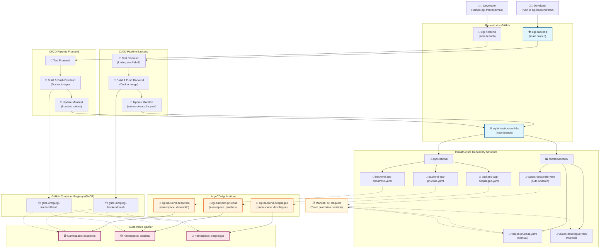

```mermaid
graph TB
    %% Repositorios
    subgraph "Repositorios GitHub"
        EGI_BACKEND["🏗️ egi-backend<br/>(main branch)"]
        EGI_FRONTEND["🎨 egi-frontend<br/>(main branch)"]
        EGI_INFRA["⚙️ egi-infrastructure-k8s<br/>(main branch)"]
    end

    %% Developer Actions
    DEV_BACKEND["👨‍💻 Developer<br/>Push to egi-backend/main"]
    DEV_FRONTEND["👨‍💻 Developer<br/>Push to egi-frontend/main"]
    
    %% GitHub Actions Pipelines
    subgraph "CI/CD Pipeline Backend"
        TEST_BE["🧪 Test Backend<br/>(Linting con flake8)"]
        BUILD_BE["🔨 Build & Push Backend<br/>(Docker image)"]
        UPDATE_BE["📝 Update Manifest<br/>(values-desarrollo.yaml)"]
    end
    
    subgraph "CI/CD Pipeline Frontend"
        TEST_FE["🧪 Test Frontend"]
        BUILD_FE["🔨 Build & Push Frontend<br/>(Docker image)"]
        UPDATE_FE["📝 Update Manifest<br/>(frontend values)"]
    end

    %% Container Registry
    subgraph "GitHub Container Registry (GHCR)"
        GHCR_BACKEND["📦 ghcr.io/org/egi-backend:hash"]
        GHCR_FRONTEND["📦 ghcr.io/org/egi-frontend:hash"]
    end

    %% Infrastructure Files
    subgraph "Infrastructure Repository Structure"
        CHARTS["📊 charts/backend/"]
        VALUES_DEV["📄 values-desarrollo.yaml<br/>(Auto-updated)"]
        VALUES_TEST["📄 values-pruebas.yaml<br/>(Manual)"]
        VALUES_PROD["📄 values-despliegue.yaml<br/>(Manual)"]
        
        APPS["📱 applications/"]
        APP_DEV["🔧 backend-app-desarrollo.yaml"]
        APP_TEST["🔧 backend-app-pruebas.yaml"]  
        APP_PROD["🔧 backend-app-despliegue.yaml"]
    end

    %% ArgoCD Applications
    subgraph "ArgoCD Applications"
        ARGO_DEV["🔄 egi-backend-desarrollo<br/>(namespace: desarrollo)"]
        ARGO_TEST["🔄 egi-backend-pruebas<br/>(namespace: pruebas)"]
        ARGO_PROD["🔄 egi-backend-despliegue<br/>(namespace: despliegue)"]
    end

    %% Kubernetes Environments
    subgraph "Kubernetes Cluster"
        NS_DEV["🟢 Namespace: desarrollo"]
        NS_TEST["🟡 Namespace: pruebas"]
        NS_PROD["🔴 Namespace: despliegue"]
    end

    %% Manual Promotion Process
    MANUAL_PR["📋 Manual Pull Request<br/>(Team promotion decision)"]

    %% Flow connections
    DEV_BACKEND --> EGI_BACKEND
    DEV_FRONTEND --> EGI_FRONTEND
    EGI_BACKEND --> TEST_BE
    EGI_FRONTEND --> TEST_FE
    TEST_BE --> BUILD_BE
    TEST_FE --> BUILD_FE
    BUILD_BE --> GHCR_BACKEND
    BUILD_FE --> GHCR_FRONTEND
    BUILD_BE --> UPDATE_BE
    BUILD_FE --> UPDATE_FE
    UPDATE_BE --> EGI_INFRA
    UPDATE_FE --> EGI_INFRA
    
    %% Infrastructure connections
    EGI_INFRA --> CHARTS
    CHARTS --> VALUES_DEV
    CHARTS --> VALUES_TEST
    CHARTS --> VALUES_PROD
    EGI_INFRA --> APPS
    APPS --> APP_DEV
    APPS --> APP_TEST
    APPS --> APP_PROD

    %% ArgoCD monitoring
    APP_DEV -.-> ARGO_DEV
    APP_TEST -.-> ARGO_TEST
    APP_PROD -.-> ARGO_PROD

    %% ArgoCD deployments
    ARGO_DEV --> NS_DEV
    ARGO_TEST --> NS_TEST
    ARGO_PROD --> NS_PROD

    %% Manual promotion flows
    VALUES_DEV -.-> MANUAL_PR
    MANUAL_PR -.-> VALUES_TEST
    VALUES_TEST -.-> MANUAL_PR
    MANUAL_PR -.-> VALUES_PROD

    %% Image pull from registry
    GHCR_BACKEND -.-> NS_DEV
    GHCR_BACKEND -.-> NS_TEST
    GHCR_BACKEND -.-> NS_PROD
    GHCR_FRONTEND -.-> NS_DEV
    GHCR_FRONTEND -.-> NS_TEST
    GHCR_FRONTEND -.-> NS_PROD

    %% Styling
    classDef repoStyle fill:#e1f5fe,stroke:#01579b,stroke-width:2px
    classDef pipelineStyle fill:#f3e5f5,stroke:#4a148c,stroke-width:2px
    classDef registryStyle fill:#e8f5e8,stroke:#1b5e20,stroke-width:2px
    classDef argoStyle fill:#fff3e0,stroke:#e65100,stroke-width:2px
    classDef k8sStyle fill:#fce4ec,stroke:#880e4f,stroke-width:2px
    classDef manualStyle fill:#fff8e1,stroke:#f57f17,stroke-width:2px

    class EGI_BACKEND,EGI_INFRA repoStyle
    class TEST,BUILD,UPDATE pipelineStyle
    class DOCKER_HUB,GHCR registryStyle
    class ARGO_DEV,ARGO_TEST,ARGO_PROD argoStyle
    class NS_DEV,NS_TEST,NS_PROD k8sStyle
    class MANUAL_PR manualStyle
```
